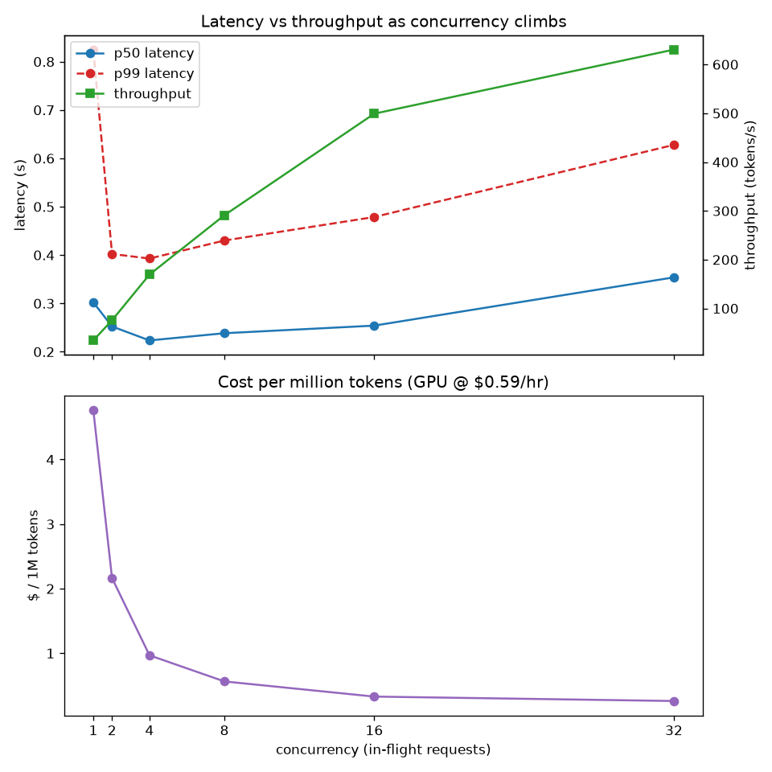

# llm-serving-bench

A local **async load generator** that drives an OpenAI-compatible LLM endpoint at rising
load and reports the three numbers that decide whether a serving setup is any good:

- **throughput** — tokens/sec the whole system sustains
- **p50 / p99 latency** — typical and tail end-to-end request time
- **cost per million tokens** — throughput turned into dollars at the GPU's hourly price

This repo is the **measuring half**. The **serving half** (vLLM on a Modal GPU) lives in a
sibling repo and is treated as a given — see [Endpoint](#endpoint-under-test) below.

## Result

One sweep against `Qwen/Qwen2.5-0.5B-Instruct` on a Modal **T4** (~$0.59/hr), driving
concurrency 1 → 32 with 40 requests held at each level:



**What it shows — the core lesson of serving economics:**

- **Throughput scales with concurrency** (~40 → ~630 tokens/sec) because the server batches
  concurrent requests, while **p50 latency stays nearly flat** (~0.22–0.35s). One request at
  a time barely uses the GPU; many at once keep it busy for almost the same per-request wait.
- **Cost per million tokens collapses** (~$4.75 → ~$0.22, roughly **20× cheaper**). The GPU
  is billed by the hour whether busy or idle, so the only way to make tokens cheap is to keep
  it saturated. At concurrency 1 you rent a GPU to mostly wait.
- **The tail (p99) is the price of load.** It rises with concurrency as requests queue behind
  batch-mates — the latency/throughput/cost tradeoff in one picture.

Caveat: throughput was *still climbing* at concurrency 32 (the container's `max_inputs`
cap), so the GPU wasn't fully saturated — the true cost floor is likely a little below the
~$0.22/M measured here. Numbers are from a single run; rerun for fresh ones.

## Endpoint under test

| | |
|---|---|
| URL | `https://musel25--vllm-server-serve.modal.run` (OpenAI-compatible) |
| Model | `Qwen/Qwen2.5-0.5B-Instruct` |
| GPU | Modal **T4** (~$0.59/hr) · vLLM 0.21.0 |
| Batching | up to 32 concurrent requests (`@modal.concurrent(max_inputs=32)`) |
| Cold start | scales to zero after 5 idle min → first request pays ~3.5 min |

The serving code lives in a separate repo, so a fresh clone of *this* repo can measure the
endpoint but can't stand it up on its own. (Acceptable for a solo learning project.)

## Architecture

```
  local machine                         Modal (rented GPU container)
┌─────────────────┐   HTTP / OpenAI    ┌────────────────────────────────┐
│ load generator  │ ─────────────────► │ vLLM serving the model on an   │
│ (openai client) │ ◄───────────────── │ OpenAI-compatible              │
│ records timings │                    │ /v1/chat/completions endpoint  │
└─────────────────┘                    └────────────────────────────────┘
```

How the measuring half is built up, one module per concern:

| module | responsibility |
|---|---|
| `src/measurement.py` | one request's result: latency + tokens (`Measurement`) |
| `src/timed_request.py` | time a single **sync** request (slice 1) |
| `src/concurrent_requests.py` | fire N requests at once with `AsyncOpenAI` + `gather` (slice 2) |
| `src/run_summary.py` | reduce a batch to p50/p99 + throughput (`RunSummary`, slice 3) |
| `src/qps_sweep.py` | drive rising concurrency, one summary per level (slice 4) |
| `src/cost.py` | throughput × GPU price → $/million tokens (slice 5) |
| `src/sweep_plot.py` | render the sweep to a PNG (slice 5) |

## Setup

This project uses [`uv`](https://docs.astral.sh/uv/) for environment and dependencies.

```bash
uv venv          # create the virtual environment
uv sync          # install dependencies from pyproject.toml / uv.lock
```

## Running

Run the full QPS sweep against the live endpoint (warms up first to absorb the cold start,
prints the table, writes `sweep.png`):

```bash
uv run python -m src.qps_sweep
```

## Tests

```bash
uv run pytest            # fast unit tests (no network)
uv run pytest -m smoke   # also hit the live endpoint (network; may trigger a cold start)
```

## How this project is built

Development follows a learning-first contract (`CLAUDE.md`): small vertical slices, each
designed, tested, explained, and committed. State lives in `PLAN.md` and `git log`, not in
chat.
